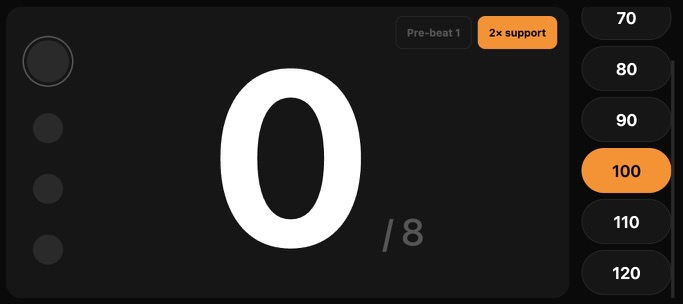

# Kikr — the missing drummer's metronome

*An experiment in whether agentic development can deliver real quality — not just working code.*

## The setup

A free morning. The plan was drumming practice.

Existing metronome apps miss what actually matters to a drummer — counting bars, holding form, training the feel of a musical phrase. They tick. That's all they do. There's a real gap on the market for a drummer's metronome.

- **Time budget:** 30 minutes
- **Domain:** well-known and simple (a metronome)
- **Tools:** Claude Code CLI in terminal, Opus 4.7
- **Plugins:** [superpowers](https://github.com/obra/superpowers)
- **Repo state:** empty folder, greenfield — no pre-existing CLAUDE.md, no custom system prompts

**TL;DR:**

- Expected less time. Took about an hour — roughly 2× the expectation.
- AI made obvious misses based on generic knowledge — e.g., applying the landscape redesign without checking that portrait still worked. Fixed only once the human in the loop looked at the result.
- AI also made some genuinely good suggestions along the way — screen wake lock was Claude's idea during brainstorming, not mine.
- Solid usable result after an hour. A tool I'll open at every practice that follows.

*Try it live: [ynovytskyy.github.io/kikr](https://ynovytskyy.github.io/kikr/)*

*Repo: [github.com/ynovytskyy/kikr](https://github.com/ynovytskyy/kikr)*

## Phase 1 — PRD, plan, agents

My opening prompt (verbatim throughout this post, typos included):

> Build me simple single page website that will be used mostly on small devices like phone or tablet as a metronome for drummers.
>
> In this fist version I want just 4/4 beat support. Palying metronome sounds as beeps but different, more expressive beep on the first beep of the bar.
> The user should be able to quickly select preconfigured bpm speed rather than typing in or going through +/- increments. I'm not sure yet what the preconfigured beats will be best (that will be a product experiment in the future) but for now let's have 80, 90, 100, 110, and 120
>
> Distinctive features:
> * Bar counter - It's important for drummers to count the structure of the pattern - So it should display the bar number and stop after eight bars
> * Simple controls like start/stop with the hit of a space bar or a tap on something really large on the screen, or maybe the whole screen (probably not the whole screen because bit selection should be selecting the BPM rather than stop and start)
> * Visually what should be on the screen would be the bar counter, the visual representation of the bits and  BPM selection

Claude Code didn't start coding. It invoked a brainstorming skill, asked three clarifying questions (auto-stop behavior, which presets to ship, screen wake lock), and wrote a short spec. I replied *"init git and proceed with implementation plan."* It produced a six-task plan and dispatched a team of subagents — one implementer per task, plus a spec-compliance reviewer and a code-quality reviewer behind each.

*25 minutes of session time, six tasks done, final review running.*

*What Phase 1 produced.*

**Takeaway from Phase 1.** I had a working app. I also had design choices an experienced practitioner wouldn't have made: a separate START button eating space, BPM pills in a row wasting horizontal real estate, no thought to landscape as the primary orientation a drummer would actually use on a kit. The agentic build made decent local decisions and missed the category-level call a domain practitioner would have made. That gap is the reason Phase 2 exists.

## Phase 2 — five iterations on the real device

I opened it on my phone, started using it, and immediately found things to change. Five iterations followed. Three were enhancements — calls a domain practitioner needed to make. Two were bug fixes — regressions the agentic build genuinely got wrong. The split itself is the lesson.

### Iteration 1 · Enhancement — Landscape-first redesign

The call that needed a drummer. Landscape is how the device sits on the kit during practice.

> Looks good, But we need another iteration on UX/UI.
> This is the screenshot of how it looks in a browser that emulates phone dimensions in landscape mode and the landscape mode is what I want to target as a primary mode for version one.
> @~/Downloads/metronome-v0.1.jpg
>
> I would like to gain maximum visibility of important elements and therefore I would like to redesign it in the following way:
> - BPM selection should be a column on the rightmost side of the screen. Also since we are going to potentially later on in later versions add more BPM pre-selections, I want that vertical column of BPMs to be scrollable up and down in case the list of BPM preselections becomes longer
> - Bit indicators within the bar should also be vertical on the left-most side of the screen again in order to gain the most space for the central part of the screen
> - The bar counter will become the largest element on the screen in the center, in the same way as it is right now but it will become larger
> - Remove the start button. Its functionality is going to be when pressing or tapping on the bar counter or the leftmost side of the screen, which is the bit indicator. Basically whenever you click anything except the BPM selector, it should work similarly to the start button. It's going to start or stop.

Result: 3-column layout, the bar counter as a giant tap-anywhere play/stop zone.

### Iteration 2 · Bug fix — Portrait got clipped

The landscape rules broke portrait. The BPM column ran off the right edge.

> Looks good, And exactly what I was looking for , but we need to do some fixing with UI for the portrait mode. The landscape mode is the primary target but all modes should be usable and UX friendly.
>
> Look at @~/Downloads/metronome-v0.2.jpg to see the problem.
>
> The way I suggest to fix it is conceptually similar to how we designed the landscape mode but in the portrait mode we want to gain space by showing it in three rows rather than three columns in landscape mode. So the top row would show the beat indicator in a horizontal way and the bottom-most row will be showing the BPM selectors but in this case scrollable horizontally.

*What I sent Claude — landscape worked, portrait was clipped.*

Result: 3-row portrait layout, BPM strip scrollable horizontally.

### Iteration 3 · Enhancement — More presets and a 2× subdivision

The controls I knew I'd want after one practice session with the app.

> - add 60 and 70 as another BPM presets (before 80)
> - a "2x" checkbox in upper right corener of the "play area" in landscape mode, and bottom right when in the portrait mode - It is going to add metronome ticks on every sub-bit, effectively making it an 8-bit - That's going to be useful when starting to practice harder, more intricate beats for the drummers and get more support from the metronome on "and" sub-bits.

Result: presets added, 2× toggle wired correctly — including the auto-stop edge case where a sub-beat tick after the final main beat would otherwise fire after the stop.

### Iteration 4 · Bug fix — Default BPM not visible on load

After adding 60 and 70, the default (100) was off-screen until you scrolled.

> - one fix: when in portrait mode, the default BPM preset is 100, but not visible in the list - need to autoscroll so that the selected BPM preset in as close to the middle of the scroll area as possible making it alaways visible when loading (until user scrolls manually). Analogous fix for the landscape mode for when the list of the presets might become longer and cause the same issue.

Result: auto-center on load, and on orientation flip.

### Iteration 5 · Enhancement — Louder samples and a count-in

The drumming-domain refinements I only wanted once I'd practiced with the app for a session.

> - is it possible to make the sound louder - not the volume level on the device, but in the sound sample.
> - we need to add pre-beat (what drummers do by hitting their drum sticks to prep for the tempo) so that there's time between starting by tapping and taking sticks and tuning to the beat and starting playing.
> - rename "2x" to "2x support"
> - add another checkbox next to "2x ..." to switch the "pre-beat" between 1 and 2 bars

Result: louder samples, a stick-click count-in toggleable between one and two bars, "2× support" rename.

## What the experiment actually says

One morning in. A tool I'll open at every drumming practice. The experiment paid.

The engineer/PM takeaway isn't "AI builds apps now." It's narrower and more useful:

- **Agentic dev is strong at executing a well-scoped plan.** Six tasks, six implementations, two reviewers behind each one. No drift.
- **Per-task agents have blind spots — their reviews are not enough on their own.** Claude's per-task reviewers all signed off on each task, but the whole-system review caught a real bug: an auto-stop callback that could fire into a new session if a drummer restarted the metronome fast enough, yanking the next count to a stop mid-bar. Without that final orchestrating step in the plan, the per-task pipeline would have shipped it.
- **But reviewer findings are input to judgment, not commands.** Modern agentic setups have evolved past single-pass review pipelines. One reviewer flagged the wake-lock code as having "unhandled promise rejections" — a serious-sounding finding. The orchestrator read the actual code, noticed both functions wrapped their `await` calls in `try/catch`, and pushed back. The change wasn't applied. The system is iterative and self-correcting in ways a linear pipeline isn't.
- **It's weak at the calls that need domain experience.** It can't tell you that drummers prop phones landscape on the kit, or that "intricate beats" means a 2× subdivision tick. It will produce a usable artifact and miss the right one.
- **The value comes from iterating with someone who knows the domain.** The five-iteration loop isn't overhead. It's the work.
